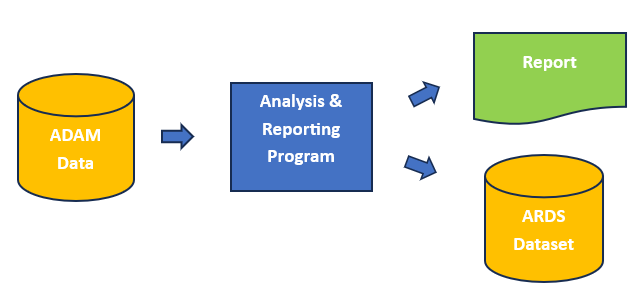

```{r, include = FALSE}
knitr::opts_chunk$set(
  collapse = TRUE,
  comment = "#>"
)
```

The functions in the **ards** package are written so that
they can be integrated
into a standard Table, Listing, and Figure (TLF) program.  In some cases, 
the program does not even need to be restructured to accommodate
the **ards** functions. This approach is called creating an ARDS in parallel.

## Parallel ARDS Example 

Let us look at such an example.
In this demonstration, we will create the analysis for a Demographics table,
and create the ARDS at the same time. 

A diagram of the parallel approach looks like this:




Note the following about the program below:

* The input data is a subset of 10 subjects and some relevant variables to make
the program easier to read and understand.
* The `init_ards()` function is called once at the top of the program.  The values
passed will be the same for all rows of the ARDS.
* The `add_ards()` function identifies variables in the analysis dataset that
you want to add to the ARDS.  The variable values will be extracted from the 
analysis data and transformed into the ARDS structure.
* The `add_ards()` function can be placed in the 
middle of a data pipeline, and will not interfere with your analysis.
* The `add_ards()` function is called immediately after the calculations, before 
any formatting or transformations.  The function is called at this point so that
the ARDS will contains the original numeric values with full precision. 
* When the analysis is complete, the `get_ards()` is called to retrieve the 
ARDS dataset.  The ARDS dataset is a standard R data frame that can be saved,
combined with other analysis results, or passed to another program for additional
processing.


```{r eval=FALSE, echo=TRUE}
library(dplyr)
library(tibble)
library(tidyr)
library(ards)

# Create input data
adsl <- read.table(header = TRUE, text = '
STUDYID	DOMAIN	USUBJID	SUBJID	SITEID	BRTHDTC	AGE	AGEU	SEX	RACE	ARMCD	ARM
ABC	DM	ABC-01-049	49	1	11/12/1966	39	YEARS	M	"WHITE"		4	"ARM D"
ABC	DM	ABC-01-050	50	1	12/19/1958	47	YEARS	M	"WHITE"		2	"ARM B"
ABC	DM	ABC-01-051	51	1	5/2/1972	34	YEARS	M	"WHITE"		  1	"ARM A"
ABC	DM	ABC-01-052	52	1	6/27/1961	45	YEARS	F	"WHITE"	    3	"ARM C"
ABC	DM	ABC-01-053	53	1	4/7/1980	26	YEARS	F	"WHITE"		  2	"ARM B"
ABC	DM	ABC-01-054	54	1	9/13/1962	44	YEARS	M	"WHITE"		  4	"ARM D"
ABC	DM	ABC-01-055	55	1	6/11/1959	47	YEARS	F	"BLACK OR AFRICAN AMERICAN" 3	"ARM C"
ABC	DM	ABC-01-056	56	1	5/2/1975	31	YEARS	M	"WHITE"		  1	"ARM A"
ABC	DM	ABC-01-113	113	1	2/8/1932	74	YEARS	M	"WHITE"		  4	"ARM D"')

# Create factors for categorical variables
# to get zero counts
adsl$SEX <- as.factor(adsl$SEX)
adsl$RACE <- as.factor(adsl$RACE)
adsl$ARM <- factor(adsl$ARM, levels = c("ARM A", "ARM B", "ARM C", "ARM D"))


# Initalize ARDS
init_ards(studyid = "ABC",
          tableid = "01", adsns = "adsl",
          population = "safety population",
          time = "SCREENING", where = "saffl = TRUE", reset = TRUE)

# Perform analysis on AGE variable
agedf <- adsl |>
  select(AGE, ARM) |>
  group_by(ARM, .drop = FALSE) |>
  summarize(n = n(),
            mean = mean(AGE),
            std = sd(AGE),
            median = median(AGE),
            min = min(AGE),
            max = max(AGE)) |>
  mutate(analvar = "AGE") |>
  ungroup() |>
  add_ards(statvars = c("n", "mean", "std", "median", "min", "max"),
           statdesc = c("N", "Mean", "Std", "Median", "Min", "Max"),
           anal_var = "AGE", trtvar = "ARM") |>
  transmute(analvar, ARM,
            n = sprintf("%d", n),
            mean_sd = sprintf("%.1f (%.2f)", mean, std),
            median = sprintf("%.1f", median),
            min_max = sprintf("%.1f-%.1f", min, max)) |>
  pivot_longer(c(n, mean_sd, median, min_max),
               names_to = "label", values_to = "stats") |>
  pivot_wider(names_from = ARM,
              values_from = c(stats)) |>
  transmute(analvar, label = c("N", "Mean (Std)", "Median", "Min-Max"),
            trtA = `ARM A`, trtB = `ARM B`, trtC = `ARM C`, trtD = `ARM D`)

# View analysis results
agedf
#   # A tibble: 4 × 6
#   analvar label      trtA        trtB         trtC        trtD        
#   <chr>   <chr>      <chr>       <chr>        <chr>       <chr>       
# 1 AGE     N          2           2            2           3           
# 2 AGE     Mean (Std) 32.5 (2.12) 36.5 (14.85) 46.0 (1.41) 52.3 (18.93)
# 3 AGE     Median     32.5        36.5         46.0        44.0        
# 4 AGE     Min-Max    31.0-34.0   26.0-47.0    45.0-47.0   39.0-74.0  

# Get population counts
trt_pop <- count(adsl, ARM) |> deframe()

trt_pop
# ARM A ARM B ARM C ARM D 
#   2     2     2     3 

# Perform analysis on SEX variable
sexdf <- adsl |>
  mutate(denom = trt_pop[paste0(adsl$ARM)]) |>
  group_by(SEX, ARM, denom, .drop = FALSE) |>
  summarize(cnt = n()) |>
  transmute(SEX, ARM, cnt, analvar = "SEX", label = SEX,  
            pct =  if_else(is.na(denom), 0, cnt / denom * 100)) |>
  ungroup() |>
  add_ards(statvars = c("cnt", "pct"), statdesc = "label",
           anal_var = "SEX", trtvar = "ARM") |>
  pivot_wider(names_from = ARM,
              values_from = c(cnt, pct)) |>
  transmute(analvar, label,
            trtA = sprintf("%1d (%3.0f%%)", `cnt_ARM A`, `pct_ARM A`),
            trtB = sprintf("%1d (%3.0f%%)", `cnt_ARM B`, `pct_ARM B`),
            trtC = sprintf("%1d (%3.0f%%)", `cnt_ARM C`, `pct_ARM C`),
            trtD = sprintf("%1d (%3.0f%%)", `cnt_ARM D`, `pct_ARM D`))

# View analysis results
sexdf
# # A tibble: 2 × 6
# analvar label trtA     trtB     trtC     trtD    
#   <chr>   <fct> <chr>    <chr>    <chr>    <chr>   
# 1 SEX     F     0 (  0%) 1 ( 50%) 2 (100%) 0 (  0%)
# 2 SEX     M     2 (100%) 1 ( 50%) 0 (  0%) 3 (100%)

# Perform analysis on RACE
racedf <- adsl |>
  mutate(denom = trt_pop[paste0(adsl$ARM)]) |>
  group_by(RACE, ARM, denom, .drop = FALSE) |>
  summarize(cnt = n()) |>
  transmute(RACE, ARM, cnt, analvar = "RACE", label = RACE,  
            pct =  if_else(is.na(denom), 0, cnt / denom * 100)) |>
  ungroup() |>
  add_ards(statvars = c("cnt", "pct"), statdesc = "label",
           anal_var = "RACE", trtvar = "ARM") |>
  pivot_wider(names_from = ARM,
              values_from = c(cnt, pct)) |>
  transmute(analvar, label,
            trtA = sprintf("%1d (%3.0f%%)", `cnt_ARM A`, `pct_ARM A`),
            trtB = sprintf("%1d (%3.0f%%)", `cnt_ARM B`, `pct_ARM B`),
            trtC = sprintf("%1d (%3.0f%%)", `cnt_ARM C`, `pct_ARM C`),
            trtD = sprintf("%1d (%3.0f%%)", `cnt_ARM D`, `pct_ARM D`))

# View analysis results
racedf
# # A tibble: 2 × 6
# analvar   label                     trtA     trtB     trtC     trtD    
#   <chr>   <fct>                     <chr>    <chr>    <chr>    <chr>   
# 1 RACE    BLACK OR AFRICAN AMERICAN 0 (  0%) 0 (  0%) 1 ( 50%) 0 (  0%)
# 2 RACE    WHITE                     2 (100%) 2 (100%) 1 ( 50%) 3 (100%)

# Combine all analysis into final data frame
final <- bind_rows(agedf, sexdf, racedf)

# View final data frame
# - This data frame is ready for reporting
final
# # A tibble: 8 × 6
# analvar   label                     trtA        trtB         trtC        trtD        
#   <chr>   <chr>                     <chr>       <chr>        <chr>       <chr>       
# 1 AGE     N                         2           2            2           3           
# 2 AGE     Mean (Std)                32.5 (2.12) 36.5 (14.85) 46.0 (1.41) 52.3 (18.93)
# 3 AGE     Median                    32.5        36.5         46.0        44.0        
# 4 AGE     Min-Max                   31.0-34.0   26.0-47.0    45.0-47.0   39.0-74.0   
# 5 SEX     F                         0 (  0%)    1 ( 50%)     2 (100%)    0 (  0%)    
# 6 SEX     M                         2 (100%)    1 ( 50%)     0 (  0%)    3 (100%)    
# 7 RACE    BLACK OR AFRICAN AMERICAN 0 (  0%)    0 (  0%)     1 ( 50%)    0 (  0%)    
# 8 RACE    WHITE                     2 (100%)    2 (100%)     1 ( 50%)    3 (100%)  


# Extract ARDS
# - This data frame can be saved to disc or inserted into a database
ards <- get_ards() 

# Remove some variables to improve readability
ards_reduced <- ards |> 
  select(trtvar, trtval, anal_var, anal_val, 
         statname, statval)

# View results
ards_reduced
#    trtvar trtval anal_var                  anal_val statname    statval
# 1     ARM  ARM A      AGE                      <NA>        n   2.000000
# 2     ARM  ARM B      AGE                      <NA>        n   2.000000
# 3     ARM  ARM C      AGE                      <NA>        n   2.000000
# 4     ARM  ARM D      AGE                      <NA>        n   3.000000
# 5     ARM  ARM A      AGE                      <NA>     mean  32.500000
# 6     ARM  ARM B      AGE                      <NA>     mean  36.500000
# 7     ARM  ARM C      AGE                      <NA>     mean  46.000000
# 8     ARM  ARM D      AGE                      <NA>     mean  52.333333
# 9     ARM  ARM A      AGE                      <NA>      std   2.121320
# 10    ARM  ARM B      AGE                      <NA>      std  14.849242
# 11    ARM  ARM C      AGE                      <NA>      std   1.414214
# 12    ARM  ARM D      AGE                      <NA>      std  18.929694
# 13    ARM  ARM A      AGE                      <NA>   median  32.500000
# 14    ARM  ARM B      AGE                      <NA>   median  36.500000
# 15    ARM  ARM C      AGE                      <NA>   median  46.000000
# 16    ARM  ARM D      AGE                      <NA>   median  44.000000
# 17    ARM  ARM A      AGE                      <NA>      min  31.000000
# 18    ARM  ARM B      AGE                      <NA>      min  26.000000
# 19    ARM  ARM C      AGE                      <NA>      min  45.000000
# 20    ARM  ARM D      AGE                      <NA>      min  39.000000
# 21    ARM  ARM A      AGE                      <NA>      max  34.000000
# 22    ARM  ARM B      AGE                      <NA>      max  47.000000
# 23    ARM  ARM C      AGE                      <NA>      max  47.000000
# 24    ARM  ARM D      AGE                      <NA>      max  74.000000
# 25    ARM  ARM A      SEX                         F      cnt   0.000000
# 26    ARM  ARM B      SEX                         F      cnt   1.000000
# 27    ARM  ARM C      SEX                         F      cnt   2.000000
# 28    ARM  ARM D      SEX                         F      cnt   0.000000
# 29    ARM  ARM A      SEX                         M      cnt   2.000000
# 30    ARM  ARM B      SEX                         M      cnt   1.000000
# 31    ARM  ARM C      SEX                         M      cnt   0.000000
# 32    ARM  ARM D      SEX                         M      cnt   3.000000
# 33    ARM  ARM A      SEX                         F      pct   0.000000
# 34    ARM  ARM B      SEX                         F      pct  50.000000
# 35    ARM  ARM C      SEX                         F      pct 100.000000
# 36    ARM  ARM D      SEX                         F      pct   0.000000
# 37    ARM  ARM A      SEX                         M      pct 100.000000
# 38    ARM  ARM B      SEX                         M      pct  50.000000
# 39    ARM  ARM C      SEX                         M      pct   0.000000
# 40    ARM  ARM D      SEX                         M      pct 100.000000
# 41    ARM  ARM A     RACE BLACK OR AFRICAN AMERICAN      cnt   0.000000
# 42    ARM  ARM B     RACE BLACK OR AFRICAN AMERICAN      cnt   0.000000
# 43    ARM  ARM C     RACE BLACK OR AFRICAN AMERICAN      cnt   1.000000
# 44    ARM  ARM D     RACE BLACK OR AFRICAN AMERICAN      cnt   0.000000
# 45    ARM  ARM A     RACE                     WHITE      cnt   2.000000
# 46    ARM  ARM B     RACE                     WHITE      cnt   2.000000
# 47    ARM  ARM C     RACE                     WHITE      cnt   1.000000
# 48    ARM  ARM D     RACE                     WHITE      cnt   3.000000
# 49    ARM  ARM A     RACE BLACK OR AFRICAN AMERICAN      pct   0.000000
# 50    ARM  ARM B     RACE BLACK OR AFRICAN AMERICAN      pct   0.000000
# 51    ARM  ARM C     RACE BLACK OR AFRICAN AMERICAN      pct  50.000000
# 52    ARM  ARM D     RACE BLACK OR AFRICAN AMERICAN      pct   0.000000
# 53    ARM  ARM A     RACE                     WHITE      pct 100.000000
# 54    ARM  ARM B     RACE                     WHITE      pct 100.000000
# 55    ARM  ARM C     RACE                     WHITE      pct  50.000000
# 56    ARM  ARM D     RACE                     WHITE      pct 100.000000

```

At this point, the analysis is complete, the output report has been created, 
and the ARDS is available for sharing with stakeholders and sending to 
downstream processes.


Next Steps: [Example 2: ARDS in Serial](ards-example2.html)


