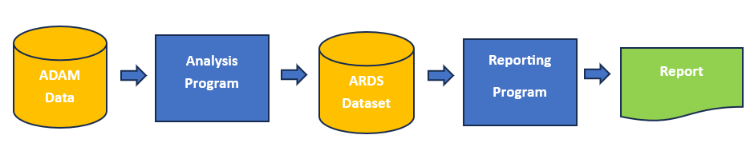

```{r, include = FALSE}
knitr::opts_chunk$set(
  collapse = TRUE,
  comment = "#>"
)
```

The **ards** package also supports a design that separates the analysis 
from the reporting.  This approach is called creating an ARDS in serial.

## Serial ARDS Example

For this examples, there are two programs.  One program performs the analysis and
saves the results in ARDS format.  The next program picks up the ARDS data,
transposes it back into a usable structure, and generates the report.

A diagram of the serial approach looks like this:




First, we'll create a program to perform the analysis.  Note the following
about the program below:

* The same data from [Example 1](ards-example1.html) is used here.
* The `init_ards()` function is called again at the top of the program. This 
call will prepare the bucket in which the analysis is dumped.
* The analysis is performed, and `add_ards()` is called to add the analysis
to the ARDS.
* This time, however, the additional steps for formatting and combining
the data are skipped.  Instead, the ARDS
data is simply extracted and stored.

Observe:
```{r eval=FALSE, echo=TRUE}
library(dplyr)
library(tibble)
library(tidyr)
library(ards)

# Create input data
adsl <- read.table(header = TRUE, text = '
STUDYID	DOMAIN	USUBJID	SUBJID	SITEID	BRTHDTC	AGE	AGEU	SEX	RACE	ARMCD	ARM
ABC	DM	ABC-01-049	49	1	11/12/1966	39	YEARS	M	"WHITE"		4	"ARM D"
ABC	DM	ABC-01-050	50	1	12/19/1958	47	YEARS	M	"WHITE"		2	"ARM B"
ABC	DM	ABC-01-051	51	1	5/2/1972	34	YEARS	M	"WHITE"		  1	"ARM A"
ABC	DM	ABC-01-052	52	1	6/27/1961	45	YEARS	F	"WHITE"	    3	"ARM C"
ABC	DM	ABC-01-053	53	1	4/7/1980	26	YEARS	F	"WHITE"		  2	"ARM B"
ABC	DM	ABC-01-054	54	1	9/13/1962	44	YEARS	M	"WHITE"		  4	"ARM D"
ABC	DM	ABC-01-055	55	1	6/11/1959	47	YEARS	F	"BLACK OR AFRICAN AMERICAN" 3	"ARM C"
ABC	DM	ABC-01-056	56	1	5/2/1975	31	YEARS	M	"WHITE"		  1	"ARM A"
ABC	DM	ABC-01-113	113	1	2/8/1932	74	YEARS	M	"WHITE"		  4	"ARM D"')

# Create factors for categorical variables
# to get zero counts
adsl$SEX <- as.factor(adsl$SEX)
adsl$RACE <- as.factor(adsl$RACE)
adsl$ARM <- factor(adsl$ARM, levels = c("ARM A", "ARM B", "ARM C", "ARM D"))


# Initalize ARDS
init_ards(studyid = "ABC",
          tableid = "01", adsns = "adsl",
          population = "safety population",
          time = "SCREENING", where = "saffl = TRUE", reset = TRUE)

# Perform analysis on AGE variable
agedf <- adsl |>
  select(AGE, ARM) |>
  group_by(ARM, .drop = FALSE) |>
  summarize(n = n(),
            mean = mean(AGE),
            std = sd(AGE),
            median = median(AGE),
            min = min(AGE),
            max = max(AGE)) |>
  mutate(analvar = "AGE") |>
  ungroup() |>
  add_ards(statvars = c("n", "mean", "std", "median", "min", "max"),
           statdesc = c("N", "Mean", "Std", "Median", "Min", "Max"),
           anal_var = "AGE", trtvar = "ARM") 

# View analysis results
agedf
# # A tibble: 4 × 8
#   ARM       n  mean   std median   min   max analvar
#   <fct> <int> <dbl> <dbl>  <dbl> <int> <int> <chr>  
# 1 ARM A     2  32.5  2.12   32.5    31    34 AGE    
# 2 ARM B     2  36.5 14.8    36.5    26    47 AGE    
# 3 ARM C     2  46    1.41   46      45    47 AGE    
# 4 ARM D     3  52.3 18.9    44      39    74 AGE    

# Get population counts
trt_pop <- count(adsl, ARM) |> deframe()

trt_pop
# ARM A ARM B ARM C ARM D 
#   2     2     2     3 

# Perform analysis on SEX variable
sexdf <- adsl |>
  mutate(denom = trt_pop[paste0(adsl$ARM)]) |>
  group_by(SEX, ARM, denom, .drop = FALSE) |>
  summarize(cnt = n()) |>
  transmute(SEX, ARM, cnt, analvar = "SEX", label = SEX,  
            pct =  if_else(is.na(denom), 0, cnt / denom * 100)) |>
  ungroup() |>
  add_ards(statvars = c("cnt", "pct"), statdesc = "label",
           anal_var = "SEX", trtvar = "ARM") 

# View analysis results
sexdf
# # A tibble: 8 × 6
#   SEX   ARM     cnt analvar label   pct
#   <fct> <fct> <int> <chr>   <fct> <dbl>
# 1 F     ARM A     0 SEX     F         0
# 2 F     ARM B     1 SEX     F        50
# 3 F     ARM C     2 SEX     F       100
# 4 F     ARM D     0 SEX     F         0
# 5 M     ARM A     2 SEX     M       100
# 6 M     ARM B     1 SEX     M        50
# 7 M     ARM C     0 SEX     M         0
# 8 M     ARM D     3 SEX     M       100

# Perform analysis on RACE
racedf <- adsl |>
  mutate(denom = trt_pop[paste0(adsl$ARM)]) |>
  group_by(RACE, ARM, denom, .drop = FALSE) |>
  summarize(cnt = n()) |>
  transmute(RACE, ARM, cnt, analvar = "RACE", label = RACE,  
            pct =  if_else(is.na(denom), 0, cnt / denom * 100)) |>
  ungroup() |>
  add_ards(statvars = c("cnt", "pct"), statdesc = "label",
           anal_var = "RACE", trtvar = "ARM") 

# View analysis results
racedf
# # A tibble: 8 × 6
#   RACE                      ARM     cnt analvar label                       pct
#   <fct>                     <fct> <int> <chr>   <fct>                     <dbl>
# 1 BLACK OR AFRICAN AMERICAN ARM A     0 RACE    BLACK OR AFRICAN AMERICAN     0
# 2 BLACK OR AFRICAN AMERICAN ARM B     0 RACE    BLACK OR AFRICAN AMERICAN     0
# 3 BLACK OR AFRICAN AMERICAN ARM C     1 RACE    BLACK OR AFRICAN AMERICAN    50
# 4 BLACK OR AFRICAN AMERICAN ARM D     0 RACE    BLACK OR AFRICAN AMERICAN     0
# 5 WHITE                     ARM A     2 RACE    WHITE                       100
# 6 WHITE                     ARM B     2 RACE    WHITE                       100
# 7 WHITE                     ARM C     1 RACE    WHITE                        50
# 8 WHITE                     ARM D     3 RACE    WHITE                       100

# Extract ARDS
ards <- get_ards() 

# Save ARDS data to file or database here

# Remove some variables to improve readability
ards_reduced <- ards |> 
  select(trtvar, trtval, anal_var, anal_val, 
         statname, statval)

# View results
ards_reduced
#    trtvar trtval anal_var                  anal_val statname    statval
# 1     ARM  ARM A      AGE                      <NA>        n   2.000000
# 2     ARM  ARM B      AGE                      <NA>        n   2.000000
# 3     ARM  ARM C      AGE                      <NA>        n   2.000000
# 4     ARM  ARM D      AGE                      <NA>        n   3.000000
# 5     ARM  ARM A      AGE                      <NA>     mean  32.500000
# 6     ARM  ARM B      AGE                      <NA>     mean  36.500000
# 7     ARM  ARM C      AGE                      <NA>     mean  46.000000
# 8     ARM  ARM D      AGE                      <NA>     mean  52.333333
# 9     ARM  ARM A      AGE                      <NA>      std   2.121320
# 10    ARM  ARM B      AGE                      <NA>      std  14.849242
# 11    ARM  ARM C      AGE                      <NA>      std   1.414214
# 12    ARM  ARM D      AGE                      <NA>      std  18.929694
# 13    ARM  ARM A      AGE                      <NA>   median  32.500000
# 14    ARM  ARM B      AGE                      <NA>   median  36.500000
# 15    ARM  ARM C      AGE                      <NA>   median  46.000000
# 16    ARM  ARM D      AGE                      <NA>   median  44.000000
# 17    ARM  ARM A      AGE                      <NA>      min  31.000000
# 18    ARM  ARM B      AGE                      <NA>      min  26.000000
# 19    ARM  ARM C      AGE                      <NA>      min  45.000000
# 20    ARM  ARM D      AGE                      <NA>      min  39.000000
# 21    ARM  ARM A      AGE                      <NA>      max  34.000000
# 22    ARM  ARM B      AGE                      <NA>      max  47.000000
# 23    ARM  ARM C      AGE                      <NA>      max  47.000000
# 24    ARM  ARM D      AGE                      <NA>      max  74.000000
# 25    ARM  ARM A      SEX                         F      cnt   0.000000
# 26    ARM  ARM B      SEX                         F      cnt   1.000000
# 27    ARM  ARM C      SEX                         F      cnt   2.000000
# 28    ARM  ARM D      SEX                         F      cnt   0.000000
# 29    ARM  ARM A      SEX                         M      cnt   2.000000
# 30    ARM  ARM B      SEX                         M      cnt   1.000000
# 31    ARM  ARM C      SEX                         M      cnt   0.000000
# 32    ARM  ARM D      SEX                         M      cnt   3.000000
# 33    ARM  ARM A      SEX                         F      pct   0.000000
# 34    ARM  ARM B      SEX                         F      pct  50.000000
# 35    ARM  ARM C      SEX                         F      pct 100.000000
# 36    ARM  ARM D      SEX                         F      pct   0.000000
# 37    ARM  ARM A      SEX                         M      pct 100.000000
# 38    ARM  ARM B      SEX                         M      pct  50.000000
# 39    ARM  ARM C      SEX                         M      pct   0.000000
# 40    ARM  ARM D      SEX                         M      pct 100.000000
# 41    ARM  ARM A     RACE BLACK OR AFRICAN AMERICAN      cnt   0.000000
# 42    ARM  ARM B     RACE BLACK OR AFRICAN AMERICAN      cnt   0.000000
# 43    ARM  ARM C     RACE BLACK OR AFRICAN AMERICAN      cnt   1.000000
# 44    ARM  ARM D     RACE BLACK OR AFRICAN AMERICAN      cnt   0.000000
# 45    ARM  ARM A     RACE                     WHITE      cnt   2.000000
# 46    ARM  ARM B     RACE                     WHITE      cnt   2.000000
# 47    ARM  ARM C     RACE                     WHITE      cnt   1.000000
# 48    ARM  ARM D     RACE                     WHITE      cnt   3.000000
# 49    ARM  ARM A     RACE BLACK OR AFRICAN AMERICAN      pct   0.000000
# 50    ARM  ARM B     RACE BLACK OR AFRICAN AMERICAN      pct   0.000000
# 51    ARM  ARM C     RACE BLACK OR AFRICAN AMERICAN      pct  50.000000
# 52    ARM  ARM D     RACE BLACK OR AFRICAN AMERICAN      pct   0.000000
# 53    ARM  ARM A     RACE                     WHITE      pct 100.000000
# 54    ARM  ARM B     RACE                     WHITE      pct 100.000000
# 55    ARM  ARM C     RACE                     WHITE      pct  50.000000
# 56    ARM  ARM D     RACE                     WHITE      pct 100.000000

```
Notice that the ARDS dataset is the exact same dataset as that produced in 
Example 1.  In this program, however, the final reporting dataset
was not created.  We will create the reporting dataset in the next program.


## Reporting from ARDS

The next program will pick up the ARDS dataset from the analysis program, 
and produce a final data frame for reporting. Note the following about this 
program:

* The first step is to convert the ARDS data back into wide form, using
the `restore_ards()` function.
* Subsequent steps format and combine the restored data to create analysis
blocks.
* The analysis blocks are combined into a single final data frame.  At this
point, the data can be fed to a reporting package of your choice.

Here is the code:
```{r eval=FALSE, echo=TRUE}

# Extract ARDS data from file or database here

# Restore to wide format
res <- restore_ards(ards)

# View results
res
# $AGE
#     ARM anal_var n     mean       std median min max
# 1 ARM A      AGE 2 32.50000  2.121320   32.5  31  34
# 2 ARM B      AGE 2 36.50000 14.849242   36.5  26  47
# 3 ARM C      AGE 2 46.00000  1.414214   46.0  45  47
# 4 ARM D      AGE 3 52.33333 18.929694   44.0  39  74
# 
# $SEX
#     ARM anal_var SEX cnt pct
# 1 ARM A      SEX   F   0   0
# 2 ARM B      SEX   F   1  50
# 3 ARM C      SEX   F   2 100
# 4 ARM D      SEX   F   0   0
# 5 ARM A      SEX   M   2 100
# 6 ARM B      SEX   M   1  50
# 7 ARM C      SEX   M   0   0
# 8 ARM D      SEX   M   3 100
# 
# $RACE
#     ARM anal_var                      RACE cnt pct
# 1 ARM A     RACE BLACK OR AFRICAN AMERICAN   0   0
# 2 ARM B     RACE BLACK OR AFRICAN AMERICAN   0   0
# 3 ARM C     RACE BLACK OR AFRICAN AMERICAN   1  50
# 4 ARM D     RACE BLACK OR AFRICAN AMERICAN   0   0
# 5 ARM A     RACE                     WHITE   2 100
# 6 ARM B     RACE                     WHITE   2 100
# 7 ARM C     RACE                     WHITE   1  50
# 8 ARM D     RACE                     WHITE   3 100

# Perform formatting on AGE analysis
agedf <- res$AGE |>
  transmute(anal_var, ARM,
            n = sprintf("%d", n),
            mean_sd = sprintf("%.1f (%.2f)", mean, std),
            median = sprintf("%.1f", median),
            min_max = sprintf("%.1f-%.1f", min, max)) |>
  pivot_longer(c(n, mean_sd, median, min_max),
               names_to = "label", values_to = "stats") |>
  pivot_wider(names_from = ARM,
              values_from = c(stats)) |>
  transmute(anal_var, label = c("N", "Mean (Std)", "Median", "Min-Max"),
            trtA = `ARM A`, trtB = `ARM B`, trtC = `ARM C`, trtD = `ARM D`)

# View analysis results
agedf
# # A tibble: 4 × 6
#   anal_var label      trtA        trtB         trtC        trtD        
#   <chr>    <chr>      <chr>       <chr>        <chr>       <chr>       
# 1 AGE      N          2           2            2           3           
# 2 AGE      Mean (Std) 32.5 (2.12) 36.5 (14.85) 46.0 (1.41) 52.3 (18.93)
# 3 AGE      Median     32.5        36.5         46.0        44.0        
# 4 AGE      Min-Max    31.0-34.0   26.0-47.0    45.0-47.0   39.0-74.0 


# Perform formatting on SEX analysis
sexdf <- res$SEX |>
  pivot_wider(names_from = ARM,
              values_from = c(cnt, pct)) |>
  transmute(anal_var, label = SEX,
            trtA = sprintf("%1d (%3.0f%%)", `cnt_ARM A`, `pct_ARM A`),
            trtB = sprintf("%1d (%3.0f%%)", `cnt_ARM B`, `pct_ARM B`),
            trtC = sprintf("%1d (%3.0f%%)", `cnt_ARM C`, `pct_ARM C`),
            trtD = sprintf("%1d (%3.0f%%)", `cnt_ARM D`, `pct_ARM D`))


# View analysis results
sexdf
# # A tibble: 2 × 6
# analvar label trtA     trtB     trtC     trtD    
#   <chr>   <fct> <chr>    <chr>    <chr>    <chr>   
# 1 SEX     F     0 (  0%) 1 ( 50%) 2 (100%) 0 (  0%)
# 2 SEX     M     2 (100%) 1 ( 50%) 0 (  0%) 3 (100%)


# Perform formatting on RACE analysis
racedf <- res$RACE |>
  pivot_wider(names_from = ARM,
              values_from = c(cnt, pct)) |>
  transmute(anal_var, label = RACE,
            trtA = sprintf("%1d (%3.0f%%)", `cnt_ARM A`, `pct_ARM A`),
            trtB = sprintf("%1d (%3.0f%%)", `cnt_ARM B`, `pct_ARM B`),
            trtC = sprintf("%1d (%3.0f%%)", `cnt_ARM C`, `pct_ARM C`),
            trtD = sprintf("%1d (%3.0f%%)", `cnt_ARM D`, `pct_ARM D`))

# View analysis results
racedf
# # A tibble: 2 × 6
#   anal_var RACE                      trtA     trtB     trtC     trtD    
#   <chr>    <chr>                     <chr>    <chr>    <chr>    <chr>   
# 1 RACE     BLACK OR AFRICAN AMERICAN 0 (  0%) 0 (  0%) 1 ( 50%) 0 (  0%)
# 2 RACE     WHITE                     2 (100%) 2 (100%) 1 ( 50%) 3 (100%)

# Combine all analysis into final data frame
final <- bind_rows(agedf, sexdf, racedf)


# View final data frame
# - This data frame is ready reporting
final
# # A tibble: 8 × 6
#   anal_var label                     trtA        trtB         trtC        trtD        
#   <chr>    <chr>                     <chr>       <chr>        <chr>       <chr>       
# 1 AGE      N                         2           2            2           3           
# 2 AGE      Mean (Std)                32.5 (2.12) 36.5 (14.85) 46.0 (1.41) 52.3 (18.93)
# 3 AGE      Median                    32.5        36.5         46.0        44.0        
# 4 AGE      Min-Max                   31.0-34.0   26.0-47.0    45.0-47.0   39.0-74.0   
# 5 SEX      F                         0 (  0%)    1 ( 50%)     2 (100%)    0 (  0%)    
# 6 SEX      M                         2 (100%)    1 ( 50%)     0 (  0%)    3 (100%)    
# 7 RACE     BLACK OR AFRICAN AMERICAN 0 (  0%)    0 (  0%)     1 ( 50%)    0 (  0%)    
# 8 RACE     WHITE                     2 (100%)    2 (100%)     1 ( 50%)    3 (100%) 

# Perform reporting here

```

While somewhat more complicated, the serial ARDS approach provides more 
flexibility.  If desired, you could create additional
programs for intext tables, figures, or for uploads to 
[ClinicalTrials.gov](https://clinicaltrials.gov/).
All of these outputs can be created from the ARDS dataset.


Next Steps: [Frequently Asked Questions](ards-faq.html)


