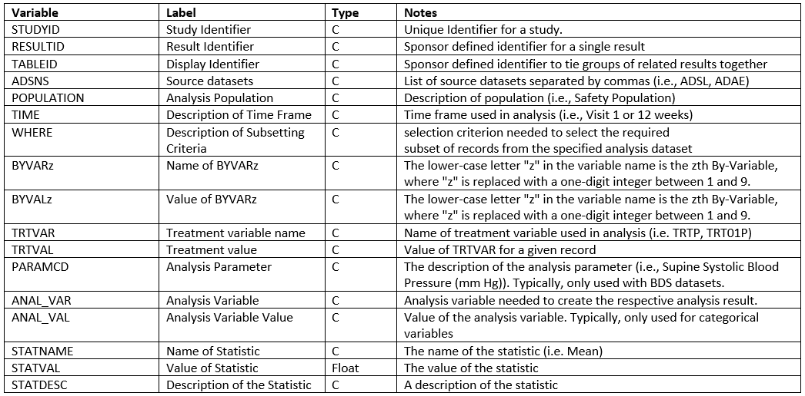
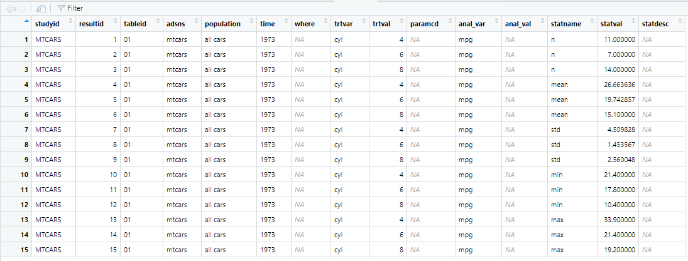
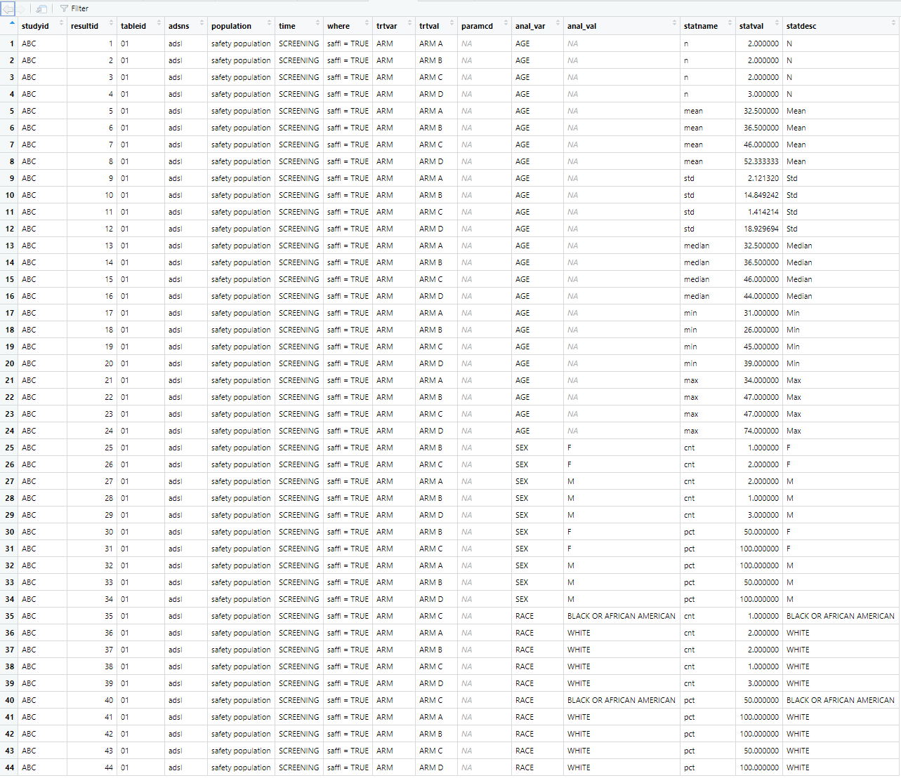

```{r, include = FALSE}
knitr::opts_chunk$set(
  collapse = TRUE,
  comment = "#>"
)
```

The **ards** package creates Analysis Results Datasets (ARDS). 
ARDS are commonly used to store the results of an analysis in a 
tabular form, so they can be examined and manipulated by downstream processes.

An ARDS dataset is created with the following steps:

1. Initialize the ARDS
2. Add data to the ARDS
3. Extract the completed ARDS

The above three steps are performed with the following functions:

* `init_ards()`:  A function to initialize the ARDS dataset. This function is typically called
at the beginning of a program.
* `add_ards()`:  A function to add data to the ARDS.  This function is typically called
along the way, as you create analysis data.
* `get_ards()`: A function to extract the ARDS dataset.  This function is typically called at 
the end of the program. 

The above steps result in an ARDS data frame.  Once this data frame is extracted,
you may save it to disk, or insert it into a database, as desired.

## ARDS Structure

The data structure produced by the **ards** package is structure
recommended by [CDISC](https://www.cdisc.org/). This structure puts all analysis 
values into a single column. 
Therefore, there is one row per analysis value.  Descriptive information, such as the 
the name of the analysis variable and the by groups, are stored in other
columns.  

Here is the data dictionary for the ARDS dataset:



## How to Use **ards**

To see how the **ards** functions work, let us first perform a very simple 
analysis on the **mtcars** sample data frame.  Examine the following example:

```{r eval=FALSE, echo=TRUE}
library(dplyr)
library(ards)

# Initialize the ARDS
# - These values will be common through the dataset
init_ards(studyid = "MTCARS",
          tableid = "01", adsns = "mtcars",
          population = "all cars",
          time = "1973", reset = TRUE)

# Perform analysis on MPG
# - Using cylinders as a by group
analdf <- mtcars |> 
  select(cyl, mpg) |> 
  group_by(cyl) |> 
  summarize(n = n(),
            mean = mean(mpg),
            std = sd(mpg),
            min = min(mpg),
            max = max(mpg))

# View analysis data
analdf
#     cyl     n  mean   std   min   max
#   <dbl> <int> <dbl> <dbl> <dbl> <dbl>
# 1     4    11  26.7  4.51  21.4  33.9
# 2     6     7  19.7  1.45  17.8  21.4
# 3     8    14  15.1  2.56  10.4  19.2

# Add analysis data to ARDS
# - These values will be unique per row
add_ards(analdf, 
         statvars = c("n", "mean", "std", "min", "max"),
         anal_var = "mpg", trtvar = "cyl")
         
         
# Get the ARDS
# - Remove by-variables to make dataset easier to read
ards <- get_ards() |> select(-starts_with("by"))

# Uncomment to view ards
# View(ards)

```
Here is an image of the ARDS dataset created above:



## Realistic Example 

As can be seen above, the functions in the **ards** package are easy to use.  
They can be integrated
into a standard Table, Listing, and Figure (TLF) program, or a data preparation
program.  In many cases, the program does not need to be restructured to accommodate
the **ards** functions.  Note that the `add_ards()` function can be placed in the 
middle of existing data pipelines, and will not interfere with your analysis.

Let us look at a more realistic program.
In this demonstration, we will create a Demographics table.  The input data
for this program is as follows:


```{r eval=FALSE, echo=TRUE}
library(dplyr)
library(tibble)
library(tidyr)
library(ards)

# Create input data
adsl <- read.table(header = TRUE, text = '
STUDYID	DOMAIN	USUBJID	SUBJID	SITEID	BRTHDTC	AGE	AGEU	SEX	RACE	ETHNIC	ARMCD	ARM
ABC	DM	ABC-01-049	49	1	11/12/1966	39	YEARS	M	"WHITE"	"NOT HISPANIC OR LATINO"	4	"ARM D"
ABC	DM	ABC-01-050	50	1	12/19/1958	47	YEARS	M	"WHITE"	"NOT HISPANIC OR LATINO"	2	"ARM B"
ABC	DM	ABC-01-051	51	1	5/2/1972	34	YEARS	M	"WHITE"	"NOT HISPANIC OR LATINO"	1	"ARM A"
ABC	DM	ABC-01-052	52	1	6/27/1961	45	YEARS	F	"WHITE"	"UNKNOWN"	3	"ARM C"
ABC	DM	ABC-01-053	53	1	4/7/1980	26	YEARS	F	"WHITE"	"NOT HISPANIC OR LATINO"	2	"ARM B"
ABC	DM	ABC-01-054	54	1	9/13/1962	44	YEARS	M	"WHITE"	"NOT HISPANIC OR LATINO"	4	"ARM D"
ABC	DM	ABC-01-055	55	1	6/11/1959	47	YEARS	F	"BLACK OR AFRICAN AMERICAN"	"UNKNOWN"	3	"ARM C"
ABC	DM	ABC-01-056	56	1	5/2/1975	31	YEARS	M	"WHITE"	"NOT HISPANIC OR LATINO"	1	"ARM A"
ABC	DM	ABC-01-113	113	1	2/8/1932	74	YEARS	M	"WHITE"	"UNKNOWN"	4	"ARM D"')

# Initalize ARDS
init_ards(studyid = "ABC",
          tableid = "01", adsns = "adsl",
          population = "safety population",
          time = "SCREENING", where = "saffl = TRUE", reset = TRUE)

# Perform AGE analysis
agedf <- adsl |>
  select(AGE, ARM) |>
  group_by(ARM) |>
  summarize(n = n(),
            mean = mean(AGE),
            std = sd(AGE),
            median = median(AGE),
            min = min(AGE),
            max = max(AGE)) |>
  mutate(analvar = "AGE") |>
  ungroup() |>
  add_ards(statvars = c("n", "mean", "std", "median", "min", "max"),
           statdesc = c("N", "Mean", "Std", "Median", "Min", "Max"),
           anal_var = "AGE", trtvar = "ARM") |>
  transmute(analvar, ARM,
            n = sprintf("%d", n),
            mean_sd = sprintf("%.1f (%.2f)", mean, std),
            median = sprintf("%.1f", median),
            min_max = sprintf("%.1f-%.1f", min, max)) |>
  pivot_longer(c(n, mean_sd, median, min_max),
               names_to = "label", values_to = "stats") |>
  pivot_wider(names_from = ARM,
              values_from = c(stats)) |>
  transmute(analvar, label = c("N", "Mean (Std)", "Median", "Min-Max"),
           trtA = `ARM A`, trtB = `ARM B`, trtC = `ARM C`, trtD = `ARM D`)

agedf
#   # A tibble: 4 × 6
#   analvar label      trtA        trtB         trtC        trtD        
#   <chr>   <chr>      <chr>       <chr>        <chr>       <chr>       
# 1 AGE     N          2           2            2           3           
# 2 AGE     Mean (Std) 32.5 (2.12) 36.5 (14.85) 46.0 (1.41) 52.3 (18.93)
# 3 AGE     Median     32.5        36.5         46.0        44.0        
# 4 AGE     Min-Max    31.0-34.0   26.0-47.0    45.0-47.0   39.0-74.0  

# Get population counts
trt_pop <- count(adsl, ARM) |> deframe()

trt_pop
# ARM A ARM B ARM C ARM D 
#   2     2     2     3 

# Perform SEX analysis
sexdf <- adsl |>
  mutate(denom = trt_pop[paste0(adsl$ARM)]) |>
  group_by(SEX, ARM, denom) |>
  summarize(cnt = n()) |>
  transmute(SEX, ARM, cnt, analvar = "SEX", label = SEX,  pct =  cnt / denom * 100) |>
  ungroup() |>
  add_ards(statvars = c("cnt", "pct"), statdesc = "label",
           anal_var = "SEX", trtvar = "ARM") |>
  pivot_wider(names_from = ARM,
              values_from = c(cnt, pct)) |>
  transmute(analvar, label,
            trtA = sprintf("%1d (%3.0f%%)", `cnt_ARM A`, `pct_ARM A`),
            trtB = sprintf("%1d (%3.0f%%)", `cnt_ARM B`, `pct_ARM B`),
            trtC = sprintf("%1d (%3.0f%%)", `cnt_ARM C`, `pct_ARM C`),
            trtD = sprintf("%1d (%3.0f%%)", `cnt_ARM D`, `pct_ARM D`))

sexdf
#   analvar label trtA      trtB     trtC      trtD     
#   <chr>   <chr> <chr>     <chr>    <chr>     <chr>    
# 1 SEX     F     NA ( NA%) 1 ( 50%) 2 (100%)  NA ( NA%)
# 2 SEX     M     2 (100%)  1 ( 50%) NA ( NA%) 3 (100%) 

# Perform RACE analysis
racedf <- adsl |>
  mutate(denom = trt_pop[paste0(adsl$ARM)]) |>
  group_by(RACE, ARM, denom) |>
  summarize(cnt = n()) |>
  transmute(RACE, ARM, cnt, analvar = "RACE", label = RACE,  pct =  cnt / denom * 100) |>
  ungroup() |>
  add_ards(statvars = c("cnt", "pct"), statdesc = "label",
           anal_var = "RACE", trtvar = "ARM") |>
  pivot_wider(names_from = ARM,
              values_from = c(cnt, pct)) |>
  transmute(analvar, label,
            trtA = sprintf("%1d (%3.0f%%)", `cnt_ARM A`, `pct_ARM A`),
            trtB = sprintf("%1d (%3.0f%%)", `cnt_ARM B`, `pct_ARM B`),
            trtC = sprintf("%1d (%3.0f%%)", `cnt_ARM C`, `pct_ARM C`),
            trtD = sprintf("%1d (%3.0f%%)", `cnt_ARM D`, `pct_ARM D`))

racedf
#   analvar label                     trtA      trtB      trtC     trtD     
#   <chr>   <chr>                     <chr>     <chr>     <chr>    <chr>    
# 1 RACE    BLACK OR AFRICAN AMERICAN NA ( NA%) NA ( NA%) 1 ( 50%) NA ( NA%)
# 2 RACE    WHITE                     2 (100%)  2 (100%)  1 ( 50%) 3 (100%) 

# Combine all analysis into final data frame
final <- bind_rows(agedf, sexdf, racedf)

final
# # A tibble: 8 × 6
#   analvar label                     trtA        trtB         trtC        trtD        
#   <chr>   <chr>                     <chr>       <chr>        <chr>       <chr>       
# 1 AGE     N                         2           2            2           3           
# 2 AGE     Mean (Std)                32.5 (2.12) 36.5 (14.85) 46.0 (1.41) 52.3 (18.93)
# 3 AGE     Median                    32.5        36.5         46.0        44.0        
# 4 AGE     Min-Max                   31.0-34.0   26.0-47.0    45.0-47.0   39.0-74.0   
# 5 SEX     F                         NA ( NA%)   1 ( 50%)     2 (100%)    NA ( NA%)   
# 6 SEX     M                         2 (100%)    1 ( 50%)     NA ( NA%)   3 (100%)    
# 7 RACE    BLACK OR AFRICAN AMERICAN NA ( NA%)   NA ( NA%)    1 ( 50%)    NA ( NA%)   
# 8 RACE    WHITE                     2 (100%)    2 (100%)     1 ( 50%)    3 (100%)  


# Extract ARDS
ards <- get_ards() |> select(-starts_with("by"))
                             
# Uncomment to view ARDS                             
# View(ards)

```
Below is the ARDS dataset created by the above code sample:

